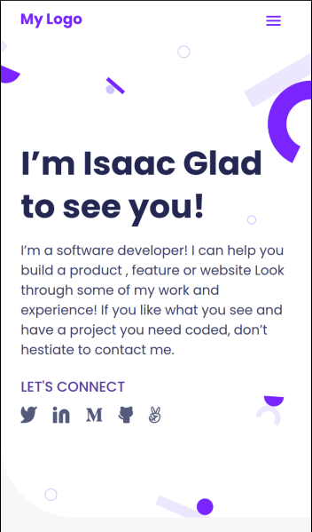
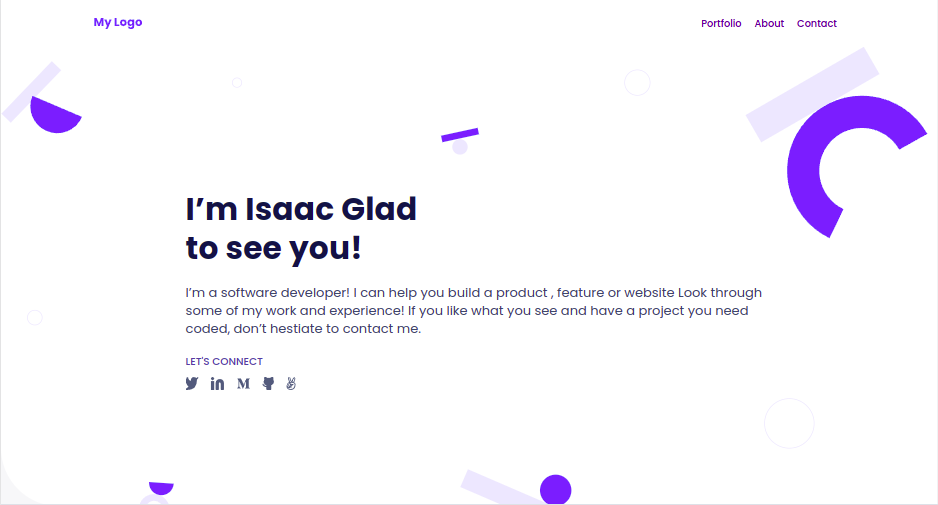

# portfolio

This is my personal portfolio to showcase my projects.

> || Mobile version || Destop Version ||
> |-|---------|-|---------|-|
> ||  ||  ||

## Built With

- HTML
- CSS
- JAVASCRIPT

## Live Demo

[Live Demo Link](https://zieeco.github.io/portfolio/)

## Getting Started

To get a local copy up and running:

1. Clone this repository or download the Zip folder:

**``git clone https://github.com/zieeco/portfolio.git``**

2. Navigate to the location of the folder in your machine:

**``you@your-Pc-name:~$ cd <folder>``**

## Author

👤 **Isaac Imaobong Samuel**

- Github: [@zieeco](https://github.com/zieeco)
- Twitter: [@zieecodes](https://twitter.com/zieecodes)
- LinkedIn: [Isaac Imaobong Samuel](https://www.linkedin.com/in/isaac-imaobong-samuel/)

## Contributing

Contributions, issues, and feature requests are welcome!

Feel free to check the [issues page.](https://github.com/zieeco/portfolio/issues)

## Show your support

Give a ⭐️ if you like this project and how we manage to build it!

## Acknowledgments

Template from this [Figma](https://www.figma.com/file/l7SqJ3ZfkAKih9sFxvWSR4/Microverse-Student-Project-1) by [Microverse](https://bit.ly/MicroverseTN)

## 📝 License

This project is [MIT](./MIT.md) licensed