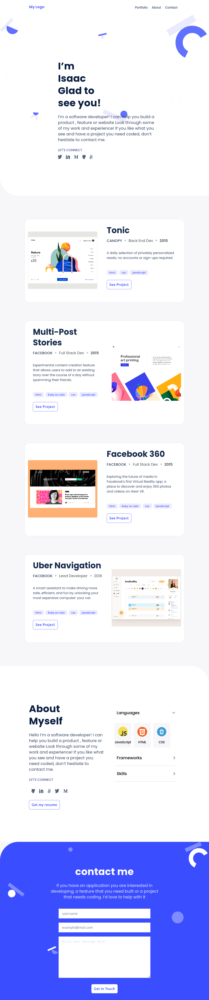

# portfolio

This is my personal portfolio to showcase my projects.

  

This project is from the Microverse curriculum. It's main objective is to help student understand how to parse a Figma design to create a user interface and also help student build their portfolio.

## Built With

- HTML
- CSS
- JAVASCRIPT

## Live Demo

[Live Demo Link](https://zieeco.github.io/portfolio/)

## Getting Started

To get a local copy up and running:

1. Clone this repository or download the Zip folder:

**``git clone https://github.com/zieeco/portfolio.git``**

2. Navigate to the location of the folder in your machine:

**``you@your-Pc-name:~$ cd <folder>``**

## Author

👤 **Isaac Samuel**

- Github: [@zieeco](https://github.com/zieeco)

- LinkedIn: [Isaac Imaobong Samuel](https://www.linkedin.com/in/isaac-imaobong-samuel-a4849b1b8/)

## Credits

Template from this [Figma](https://www.figma.com/file/l7SqJ3ZfkAKih9sFxvWSR4/Microverse-Student-Project-1) by [Microverse](https://bit.ly/MicroverseTN)

## Contributing

Contributions, issues, and feature requests are welcome!

## Show your support

Give a ⭐️ if you like this project and how we manage to build it!

## 📝 License

This project is [MIT](./MIT.md) licensed